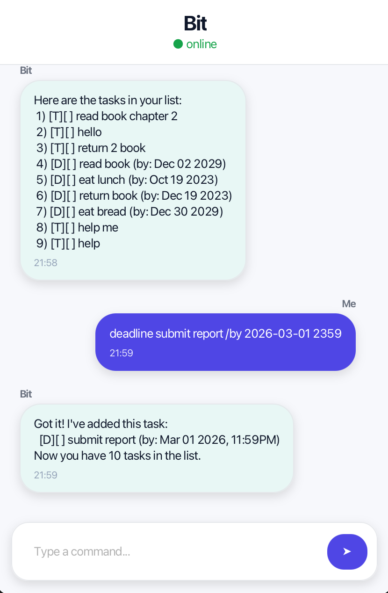

# Bit User Guide

Bit is a lightweight task manager that helps users manage their tasks efficiently using simple command-line inputs.

It supports managing **todos**, **deadlines**, and **events**, and allows users to update, search, and organise tasks quickly.

---

## User Interface

Below is the graphical interface of Bit.



---

## Command Summary

| Command | Description |
|-------|-------------|
| `todo <description>` | Adds a todo task |
| `deadline <description> /by <date>` | Adds a deadline task |
| `event <description> /from <start> /to <end>` | Adds an event task |
| `list` | Displays all tasks |
| `mark <number>` | Marks a task as completed |
| `unmark <number>` | Marks a task as not completed |
| `update <number> <new details>` | Updates a task |
| `delete <number>` | Deletes a task |
| `find <keyword>` | Finds tasks containing a keyword |
| `bye` | Exits the application |

---

# Features

## Adding a Todo

Adds a simple task to the task list.

**Format**

```
todo <description>
```

**Example**

```
todo read book
```

The task will be added to the task list.

---

## Adding a Deadline

Adds a task with a deadline.

**Format**

```
deadline <description> /by <date>
```

**Example**

```
deadline submit report /by 2029-12-30
```

The task will be added with the specified deadline.

---

## Adding an Event

Adds an event with a start and end time.

**Format**

```
event <description> /from <start> /to <end>
```

**Example**

```
event meeting /from 2029-12-30 /to 2029-12-30
```

The event will be added to the task list.

---

## Listing Tasks

Displays all tasks currently stored.

**Format**

```
list
```

---

## Marking Tasks

Marks a task as completed.

**Format**

```
mark <task number>
```

**Example**

```
mark 2
```

The specified task will be marked as completed.

---

## Unmarking Tasks

Marks a task as not completed.

**Format**

```
unmark <task number>
```

**Example**

```
unmark 2
```

The specified task will be marked as incomplete.

---

## Updating Tasks

Updates the description of an existing task.

**Format**

```
update <task number> <new description>
```

**Example**

```
update 1 read chapter 5
```

The task description will be updated.

---

## Deleting Tasks

Deletes a task from the list.

**Format**

```
delete <task number>
```

**Example**

```
delete 3
```

The specified task will be removed from the task list.

---

## Finding Tasks

Searches for tasks containing a keyword.

**Format**

```
find <keyword>
```

**Example**

```
find book
```

All tasks containing the keyword will be displayed.

---

## Exiting the Application

Closes the application.

**Format**

```
bye
```

The program will terminate.